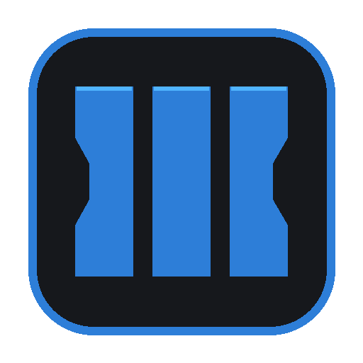

<div align="center">

<h1 align="center">
  <br>
  [ZXG] T7 Workshop<br>
  <sub>&nbsp;</sub>
</h1>

<div align="center">

### Gestionnaire moderne pour le Workshop de Call of Duty: Black Ops III

Analysez, organisez et gérez facilement vos maps Custom Zombies et vos mods depuis une interface moderne conçue pour la communauté BO3.

</div>

<br>

[](../../releases/latest)
[](../../releases/latest)
[](#configuration-requise)
[](https://discord.gg/4cb3ENTXd4)

<br>

[**Télécharger la dernière version**](../../releases/latest)
&nbsp;&nbsp;•&nbsp;&nbsp;
[**Site officiel**](https://www.zxg.fr)
&nbsp;&nbsp;•&nbsp;&nbsp;
[**Discord**](https://discord.gg/4cb3ENTXd4)

</div>

---

## Présentation

**[ZXG] T7 Workshop** est une application Windows permettant de gérer les créations du Workshop de **Call of Duty: Black Ops III**.

L’application détecte automatiquement vos maps et vos mods, affiche leur taille, permet de les organiser et facilite l’accès aux différentes fonctionnalités du Workshop Steam.

Elle propose également un système de gestion des langues pour les créations compatibles.

---

## Fonctionnalités

### Workshop

- Détection automatique des maps et des mods installés
- Séparation des créations entre **Maps** et **Mods**
- Recherche globale depuis toutes les pages
- Affichage de la taille de chaque création
- Calcul de l’espace total utilisé
- Aperçu des maps avec leurs images Workshop
- Accès direct aux articles Steam
- Copie rapide des liens Workshop
- Accès aux dossiers Steam, Black Ops III et Workshop

### Bibliothèque

- Ajout de créations aux favoris
- Liste de téléchargements en attente
- Historique des créations consultées
- Affichage des créations installées
- Informations sur l’auteur, la taille et le Workshop ID
- Partage rapide des maps et des mods

### Gestion des langues

- Détection des langues présentes dans les créations
- Prise en charge des contenus français, anglais et multilingues
- Changement de langue pour les créations compatibles
- Protection contre les doublons et les fichiers incohérents
- Blocage automatique des changements incompatibles

### Steam

- Détection de l’état de Steam
- Affichage du profil Steam actif
- Accès direct au profil Steam
- Copie du code ami
- Intégration Steamworks pour Black Ops III
- Aucun identifiant ou mot de passe demandé

### Maintenance

- Vérification des mises à jour Workshop
- Actualisation manuelle du scan
- Détection des fichiers de crash `.dmp`
- Nettoyage des fichiers inutiles
- Vérification des dossiers essentiels
- Surveillance de l’espace de stockage

### Mod Tools

- Présentation des domaines Mapping, Scripting, FX et Audio
- Galerie des projets de la communauté
- Suivi des créations en développement
- Accès au site ZXG
- Accès au Discord ModTools France

---

## Langues disponibles

L’interface de l’application est disponible dans les langues suivantes :

| Langue | État |
|:--|:--:|
| 🇫🇷 Français | ✅ |
| 🇬🇧 Anglais | ✅ |
| 🇵🇹 Portugais | ✅ |
| 🇪🇸 Espagnol | ✅ |
| 🇩🇪 Allemand | ✅ |
| 🇮🇹 Italien | ✅ |
| 🇵🇱 Polonais | ✅ |
| 🇹🇷 Turc | ✅ |
| 🇷🇺 Russe | ✅ |

La langue peut être modifiée directement depuis les paramètres.

---

## Installation

1. Ouvrez la page des [releases GitHub](../../releases/latest).
2. Téléchargez **`[ZXG] T7 Workshop - 1.0.1.exe.zip`**, puis extrayez complètement l’archive.
3. Vérifiez que Steam est démarré.
4. Lancez l’exécutable.

> L’application est autonome : aucune installation supplémentaire de .NET n’est nécessaire.

---

## Configuration requise

- Windows 10 ou Windows 11 en 64 bits
- Steam
- Call of Duty: Black Ops III
- Workshop Steam de Black Ops III
- AppID Steam : `311210`

---

## Respect de la vie privée

- Aucun formulaire de connexion Steam
- Aucun mot de passe demandé
- Aucun identifiant sensible enregistré
- Analyse effectuée localement à partir des fichiers présents sur votre ordinateur

Steam doit uniquement être démarré pour les fonctionnalités utilisant Steamworks.

---

## Résolution des problèmes

### Mes créations ne sont pas détectées

Vérifiez que Steam et Black Ops III sont installés, puis utilisez l’action **Rafraîchir le scan Workshop** dans les paramètres.

Le dossier Workshop suivant doit être présent :

```text
steamapps\workshop\content\311210
```

### Steam n’est pas détecté

Démarrez complètement Steam avant de lancer l’application.

### Une langue ne peut pas être appliquée

Certaines créations ne contiennent qu’une seule langue. L’application bloque les changements incompatibles afin d’éviter les fichiers manquants ou corrompus.

### Windows affiche un avertissement

Windows SmartScreen peut afficher un avertissement lors du premier lancement si l’exécutable n’est pas encore signé numériquement.

---

## Liens

<div align="center">

[](https://www.zxg.fr)
[](https://discord.gg/4cb3ENTXd4)
[](https://steamcommunity.com/app/311210/workshop/)

</div>

---

<div align="center">

Développé avec passion par **STARZISMIK**

**[ZXG] T7 Workshop — Version 1.0.1**

© 2026 STARZISMIK

</div>
